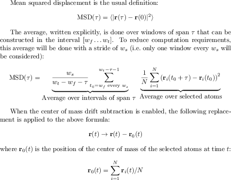
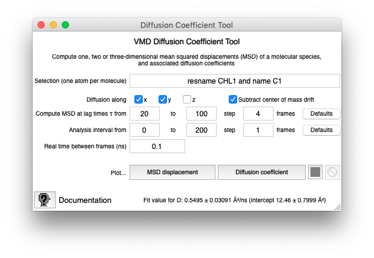

Diffusion Coefficient Tool
==========================

The [Diffusion Coefficient Tool](#) is an analysis plugin for VMD that computes one, two or three-dimensional mean squared displacements (MSD)-based diffusion coefficients of a chosen molecular species.

Installation
------------

VMD 1.9.2 or later is required. For installation instructions, follow
Method 1 explained
[here](https://gist.github.com/tonigi/a9cfaf7642a7fbc13293).
The statement to add in the custom dialog is:

    source /path/to/vmd_diffusion_coefficient/load.tcl

The same command can be used in VMD's Tk Console to load the plugin 
manually.

Test and example
----------------

To test, see the [regtest.tcl](../demo/regtest.tcl) script in the
`demo` directory.  E.g., in VMD's Tk Console, issue

    play regtest.tcl

The test computes the lateral diffusion coefficient
of cholesterol in a 1:1 POPC:CHL membrane on the basis of pre-computed
simulation data from the *Case Study* supplement of [Guixà-González et
al.](http://doi.org/10.1093/bioinformatics/btu037). The result, 0.55 ±
0.031 Ų/ns (at 310 °K), matches well the experimental value of 5.5
10-12 m²/s (at 308 °K) in Table 1 of [Filippov et
al.](https://doi.org/10.1021/la034222x) (see below for units
conversions).

Usage (GUI)
-----------

The plugin is accessible from VMD in *Extensions \> Analysis \> Diffusion Coefficient Tool*. The profile is computed for the currently loaded trajectory in the *top* molecule. The atom selection must match one atom per diffusing molecule; MSD values will be averaged over the matched atoms.

Buttons are provided to

- plot the **MSD displacement** MSD(τ);
- plot the "instantaneous" **Diffusion coefficient** D(τ). The latter is computed with the Einstein relation as *D(τ)=MSD(τ)/2Eτ*, where *E* is the integer dimensionality of the system (1, 2 or 3). (Note that it's not a linear fit.);
- save the results of the computation to a CSV file.

In all cases, a linear fit of the MSD displacement over the selected range of τ is performed and the results (with standard error) are output on the status line,  standard output, or written to the CSV file header as appropriate.

The **Analysis interval** boxes allow to specify a subsection of the trajectory to be used for the MSD calculation. Only displacements in the subspace spanned by the **Diffusion along** axes will be considered. In other words, if *z* is deselected, motions along that axes will be irrelevant for the calculation of MSD and D.

Usage (command line)
--------------------

You need to load the package with `package require diffusion_coefficient`. The plugin can perform the following computations

-   MSD at a given lag time (in frames). The return value will be in
    Ų, and its value is independent of the time units. 

-   MSD for an interval of lag times (`from`, `to`, `step` options)

-   D, computed as above, for an interval of lag times. The formula is
	only valid in the diffusive regime and with pointlike particles

-   D, computed by least-squares fitting MSD to a linear function in τ.
	This is the most commonly used method.

Invocation is self-explanatory, i.e.:

    VMD Diffusion Coefficient tool. Computes one, two or three-dimensional
    MSD-based diffusion coefficients of a chosen molecular species.

    Usage: diffusion_coefficient <options> <command>

    Command is one of:
    -msd <NN>     Compute mean squared displacement (MSD) at a tau of
                  NN frames; equivalent to msd_interval -from NN -to NN.
                  Returns a value as Angstrom^2 . This is the recommended 
                  way of using the plugin.
    -msd range    Compute MSD for taus between -from and -to (mandatory)
                  Returns two lists of {tau} {MSD(tau)}
    -d range      Compute D(tau)=MSD(tau)/(2*D*tau) between -from and
                  -to (mandatory). Returns two lists of {tau} {D(tau)}
    -fitD range   Compute D by a linear fit of MSD over the specified
                  range. Returns a list of {D D_err S S_err} where
                  D is the MSD slope divided by 2D; S is the MSD intercept; 
                  and _err are the respective standard errors.

The following table lists the correspondence between the GUI and
function arguments.

| GUI text            | Function argument | Default value          |
|---------------------|-------------------|------------------------|
| Selection           | `-selection`      | `water and noh`    |
| Diffusion along     | `-alongx`, etc.   | 3D                     |
| Subtract drift      | `-remove_drift`   | Enabled                |
| τ from              | `-from`           | Trajectory length / 10 |
| τ to                | `-to`             | Trajectory length / 2  |
| τ step              | `-step`           | Trajectory length / 50 |
| Analysis from       | `-interval_from`  | Trajectory start       |
| Analysis to         | `-interval_to`    | Trajectory end         |
| Analysis step       | `-interval_step`  | All frames             |
| Time between frames | `-dt`             | 1 ns                   |

Averaging
---------

| Symbol above  | GUI parameter name     | Command line option |
|---------------|------------------------|---------------------|
| wf | Analysis interval from | `-interval_from`    |
| wt | Analysis interval to   | `-interval_to`      |
| ws | Analysis interval step | `-interval_stride`  |

Units
-----

The results are given in Å2/ns. Conversion factors:

-   0.1 Å2/ns = 10-12 m2/s = 10-8 cm2/s = 1 μm2/s

-   1 cm²/s = 107 Ų/ns

-   1 m²/s = 1011 Ų/ns

-   1 μm²/s = 0.1 Ų/ns

-   1 Ų/ns = 10-7 cm²/s = 10-11 m²/s = 10 μm²/s

Notes
-----

-   The Diffusion Coefficient Tool is not a magic box. It only
    computes mean squared displacements (MSD) at a variety of lag
    times (τ). The MSD is predicted by Einstein's relation to grow
    linearly with τ. Most often than not, this DOES NOT occur in
    practice, for a variety of reasons, including poor sampling or
    non-diffusive behavior. It is YOUR responsibility to understand
    why and, if you trust the linearity, to fit the slope. Please
    consider the following paper to be **mandatory reading**: [David
    Keffer, The Working Man's Guide to Obtaining Self Diffusion
    Coefficients from Molecular Dynamics
    Simulations](http://utkstair.org/clausius/docs/che548/pdf/selfD.pdf).

-   The point-wise formula for *D* is only valid for small particles
	in the diffusive (Brownian) regime. In general, you should instead
	perform a linear fit of MSD over a range of τ values, and discard
	the intercept (see [Martin et al., 2002](https://linkinghub.elsevier.com/retrieve/pii/S0006349502739714)). 

-   Computing converged diffusion coefficients is likely beyond your
    sampling capacity and patience, unless done for plenty of
    molecules (ie. solvent). Don't draw premature conclusions: expect
    **microseconds** sampling.

-   The trajectory must not be wrapped. Some MD simulation software
    (notably GROMACS) tend to write trajectories in the *wrapped*
    format, i.e., with atom positions remapped to the "origin"
    periodic image.  This format is inappropriate for MSD
    calculations: trajectories have to be unwrapped first (use the
    `pbc unwrap` or `gmx trjconv` tools).

-   A check is performed whether bonds exist between the selected
    atoms. This check may fail if wrong connectivity is inferred on
    molecule load.

Screenshot
----------

Citation
--------

Please cite the following publication:

> Toni Giorgino, Computing diffusion coefficients in macromolecular simulations: the Diffusion Coefficient Tool for VMD. Journal of Open Source Software, 4(41), 1698, [doi:10.21105.joss.01698](http://doi.org/doi:10.21105.joss.01698) Available from [GitHub](https://github.com/giorginolab/vmd_diffusion_coefficient/). 

Support
-------

**NOTE: This code comes without any warranty of fitness for any
use. It is UNSUPPORTED.** You may be able to get support by opening an
issue in the tool's [GitHub
repository](https://github.com/giorginolab/vmd_diffusion_coefficient/),
or by posting to the [External
tools](https://sourceforge.net/p/membplugin/discussion/external_tools/)
forum hosted at the [MEMBPLUGIN](http://membplugin.sourceforge.net)
site. Contributions may be provided via GitHub's *Pull Requests*.

License
-------

By downloading the software you agree to comply with the terms of the
[3-clause BSD license](../LICENSE). The TCL linear fitting code is 
reproduced from TCLLIB's [linear-model](https://tools.ietf.org/doc/tcllib/html/statistics.html#23) 
function. Tcl/Tk [licensing terms](https://www.tcl.tk/software/tcltk/license.html) apply to it.

Acknowledgments
---------------

Work on this software started while at the CBBL of the Universitat 
Pompeu Fabra (GRIB-IMIM-UPF). Former support from the Agència de Gestió d'Ajuts Universitaris i de
Recerca - Generalitat de Catalunya is gratefully acknowledged.

