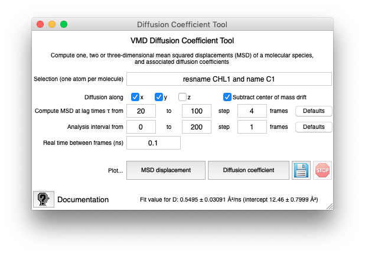

# Summary

Computing diffusion coefficients from classical molecular dynamics
(MD) simulations is a common task when assessing solvent and lipid
dynamics both in bulk and in confined regions. Solute-modulated
lateral diffusion of lipids is especially interesting in biological
membranes, where it plays a role in receptor activity and raft
formation [@dainese_membrane_2014].

The Diffusion Coefficient Tool is an analysis plugin for the Visual
Molecular Dynamics (VMD) analysis environment [@humphrey_vmd_1996],
which computes various types of diffusion coefficients for a molecular
species from simulated trajectories.

# Method

Diffusion coefficients are computed on the basis of time- and
ensemble-averaged squared displacement (MSD) of the chosen molecular
species.  The MSD $M(\tau)$ is defined by fixing an arbitrary time
origin and a *lag time* $\tau$ as the mean displacement over that
interval:

$$ M(\tau) = \langle | \mathbf r (\tau) - \mathbf r(0) |^2 \rangle $$

where $\mathbf r(t)$ indicates the position of a particle at time $t$,
and the angle brackets indicate an average over all particles of the
species under analysis. In practice, to improve convergence, the MSD
analysis is repeated using different time origins, under the
equilibrium assumption.  If the system is in a diffusive regime and
the position measurement error is negligible, the diffusion
coefficient can be obtained through Einstein's relation:

$$ D(\tau) = M(\tau) / 2E\tau $$

where $E$ is the dimensionality of the system (integer, $1 \leq E \leq 3$). 
In general, MSD values at multiple lag times are computed from the
same trajectory to check their linearity and asymptotic slope in
$\tau$ to check diffusivity and average out measurement errors
[@martin_apparent_2002].

# Implementation

After installation, the plugin is accessible from VMD in the *Extensions -
Analysis - Diffusion Coefficient Tool* menu. The analysis is run on the
currently loaded trajectory in the *top* molecule (Figure 1).
The diffusion coefficient tool can be used either interactively with
its graphical user interface (GUI, Figure 1), or calling the 
`diffusion_coefficient` procedure in VMD's embedded TCL language.

The tool can compute the following quantities:

 * $M(\tau)$ ("MSD displacement" GUI button, or procedure argument `-msd`) 
 * "Instantaneous" $D(\tau) = M(\tau)/2E\tau$, valid as long as diffusivity holds and position errors are small (button "Diffusion coefficient", argument `-d`) 
 * $D$ (and its standard error) through least-squares fitting of $M(\tau)$ to $2 E D \tau + \sigma$  (button "Linear fit", argument `-fitD`).
 
The results are either plotted (GUI) or returned as a list (procedure
call).  The following table lists the correspondence between the GUI
and procedure arguments.

| GUI text            | Procedure argument | Default value          |
|---------------------+-------------------+------------------------|
| Selection           | `-selection`      | `water and noh`        |
| Diffusion along     | `-alongx`, etc.   | 3D                     |
| Subtract drift      | `-remove_drift`   | Enabled                |
| $\tau$ from         | `-from`           | Trajectory length / 10 |
| $\tau$ to           | `-to`             | Trajectory length / 2  |
| $\tau$ step         | `-step`           | Trajectory length / 50 |
| Analysis from       | `-interval_from`  | Trajectory start       |
| Analysis to         | `-interval_to`    | Trajectory end         |
| Analysis step       | `-interval_step`  | All frames             |
| Time between frames | `-dt`             | 1 ns                   |

The time averaging scheme and interpretation of the interval window
parameters is shown in Figure 2: averaging occurs over the windows of
span $\tau$ that can be constructed in the analysis interval, strided
by an *interval step*. The analysis is repeated for the chosen values
of $\tau$, ranging from a minimum to a maximum, again with a stride.

Note that obtaining *converged* MSD values from MD simulations requires
an aggregated sampling much larger than the characteristic time $\tau$.
In common MD regimes such sampling can only be achieved as long
as several equivalent atoms are available for averaging.  For this
reason, the plugin provides an atom selection, which must match one
atom per diffusing molecule, for MSD values to be averaged over.

# Related tools

MEMBPLUGIN is a VMD plugin which implements additional analysis types
specifically for quasi-planar bilayer simulations
[@guixa-gonzalez_membplugin:_2014]. This tool's regression test is based
on the case study trajectories provided with MEMBPLUGIN.
The `gmx msd`  utility is distributed with GROMACS and
performs a similar MSD calculation from the command line shell
[@lemkul_proteins_2019].

# References
